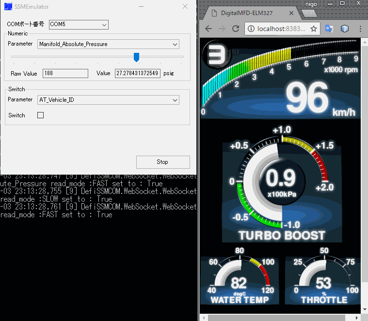
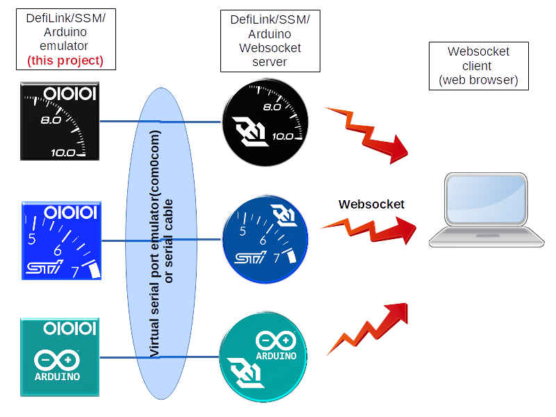
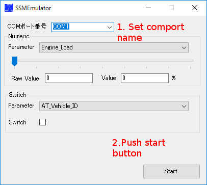

# Defilink/SSM/Arduino sensor serial communication emulator

## What is this.
 This program emulate serial communication of DefiLink/SSM/[Arduino sensor reader](https://github.com/sugiuraii/ArduinoPulseSensorGeneratorReader) to support the programing/debugging of [WebSocketGaugeClient](https://github.com/sugiuraii/WebSocketGaugeClientNeo).
 This program can be connetced with [WebSocketGaugeServer](https://github.com/sugiuraii/WebSocketGaugeServer) via virtual serial port emulator (such as [com0com](http://com0com.sourceforge.net/)). Currently, ELM327 version of emulator is not available on this project. However, you can use [OBDsim](https://icculus.org/obdgpslogger/obdsim.html) for that purpose.

## Requirement
* Windows with .Net Core SDK 3.1.
* Virtual serial port emulator (such as [com0com](http://com0com.sourceforge.net/)), or serial cable.

## Install and launch
 There is no installer for thie program. Simply download the binary zip file from [Release](https://github.com/sugiuraii/DefiCOM_SSMCOM_Emulator/releases), unzip it and run exe file.
 Before running this program, you have to create two virtual COM port (or prepare two PC with serial port).
 After running the program, set the COM port name by COM port selector box and push "Start" button.

## References
* Defi-link communication procotol is reffered from [Defigate](http://kaele.com/~kashima/car/defigate/)
* SSM communication procotol is reffered from [this site](http://www.romraider.com/RomRaider/SsmProtocol).

## License
The 3-Clause BSD License